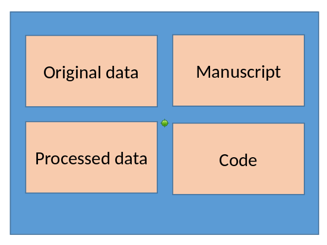

# Credits and Disclaimer

Based on earlier presentations: [Cornell Day of Data 2021](https://labordynamicsinstitute.github.io/day-of-data-2021/) w/ David Wasser,  [MONT^2](https://www.mont2-econlab.com/), [FSRDC conference](https://https://larsvilhuber.github.io/reproducibility-confidential-fsrdc).

*The opinions expressed in this talk are solely the author, and do not represent the views of the U.S. Census Bureau, the American Economic Association,  any of the funding agencies, or any previous co-authors...*

## Overview

| | | 
|----|-----|
| [Part 1:](#8)  |  Why? |
| [Part 2:](#15) |  Secure coding techniques|
| [Part 3:](#27) |  Efficient coding techniques |
| [Part 4:](#48) |  Documenting what you did  |

# Why?

## Why worry about reproducibility?

... when nobody can see your data?


## Key considerations?

- Because somebody else *will* access your data, or similar data.
- Because it will actually save you time
- Because if you want to publish, you may need to show reproducibility

## Journals may access the data

```{r, out.width = "90%", out.height = "85%", fig.cap= "AEA workflow", echo=FALSE}


```

## Reproducibility = own time


```{r, out.width = "90%", out.height = "85%", fig.cap= "FB problem", echo=FALSE}


```

## Journals require it

- In a typical year, we (AEA) will **obtain access (or request access) to 20%** of data that is confidential
- Some journals will require that it be provided (privately) and won't publish otherwise


# Part 1 | File structure

## Generic project setup


[TIER Protocol](https://www.projecttier.org/tier-protocol/specifications-3-0/)

## Basic project setup


**Structure your project**

- Data inputs
- Data outputs
- Code
- Paper/text/etc.


## Project setup examples


<table width="100%">
<tr>
<td width="50%">
```
/inputs
/outputs
/code
/paper
```
</td><td>

```
/dados/
    /brutos
    /limpos
    /finais
/codigo
/artigo
```
</td></tr></table>

It doesn't really matter, as long as it is logical. 


# Adapting to confidential / big data

## Back to the TIER protocol


## Back to the TIER protocol




## When data are confidential


## When data are confidential


## Project setup examples


<table width="100%">
<tr>
<td width="50%">

This may no longer work:

```
/dados/
    /brutos
    /limpos
    /finais
/codigo
/artigo
```
</td>
<td>
This may be what it looks like:

```
/projeto/
     /dados/
        /brutos
        /limpos
        /finais
     /codigo
     /artigo
/secredos            (read-only)
     /impostos      (read-only)
     /salarios       (read-only)
```

</td></tr></table>

## Project setup examples


<table width="100%">
<tr>
<td width="50%">

This may be what it looks like:

```
/projeto/
     /dados/
        /brutos
        /limpos
        /finais
     /codigo
     /artigo
/secredos            (read-only)
     /impostos       (read-only)
     /salarios       (read-only)
```
</td>
<td>
Or maybe even:

```
/projeto/
     /dados/
        /brutos
        /limpos
        /finais
     /codigo
     /artigo
/secredos            (read-only)
     /impostos/
              /v1/   (read-only)
              /v2/   (read-only)
     /salarios       (read-only)
```

</td></tr></table>

How do we handle directories outside of the project space?


# Part 2 | Programming practices

## No manual manipulation 


**DO NOT DO THIS**

- “Change the parameter to 0.2, then run the code again”

**DO DO THIS**

- Use code:
  - Use *functions*, ado files, programs, macros, subroutines
  - Use *loops*, parameters, *parameter files* to call those subroutines
  - Use *placeholders* (globals, macros, libnames, etc.) for common locations ($CONFDATA, $TABLES, $CODE)
- Compute all numbers in package
  - No manual calculation of numbers

## Streamlining | No manual interaction

**DO NOT DO THIS**

- "The figure will display in a window, save it to the paper directory"
- "The logfile will show the regression coeffs, copy them into the Excel sheet"

**DO DO THIS**

- Dynamic documents$^*$
- Write out/save tables and figures using packages
- Use functionality to write directly into Excel sheets


## Streanlining | Packages

- No manual install of packages
  - Use a script to create all directories, install all necessary packages/requirements/etc.
  - Use tools like `renv` (R), `requirements.txt` (Python), `project.toml` (Julia)
  - Write all Stata packages into a project-specific directory and do not re-install

## Streamlining | Stata

```{stata, eval=FALSE}
// Header of main.do

global rootdir : pwd
global adodir  "${rootdir}/ado"
cap mkdir "$adodir"
adopath ++ "$adodir"
adopath - PLUS     // Just to be sure
adopath - PERSONAL // Just to be sure
cap ssc install estout // this will now go into the new adodir we created!
```

## Streamlining | Scripts

- Controller  script (`main.do`, `run.sh`, `makefile`) preferred
  - Least amount of manual effort
- Clear instructions


## Streamlining | Automation

### Repeatedly running through the entire sequence ensures later robustness

- Presumes a single control file (`main.do`, `run.sh`)
- Presumes ability to version results!
- Leverage (data provider-specific) tools, such as job queues
- Use free resources
  - Job queues with low priority
  - Human downtimes (leaving for a holiday, going to a conference)


## Streamlining | Automation

### Introduce break points

- Do not reprocess when no changes to data or code happen
- Always reprocess if data or code change 
- Decision might be 
  - Manual (flags)
  - Automated (`make`, checksums, etc.)
  
## Streamlining | Automation

### Introduce break points: manual

```{stata, eval=FALSE}
// Header of main.do
global step1 0
global step2 1
global step3 1

if $step1 == 1  do "$code/01_extract.do"
if $step2 == 1  do "$code/02_analysis.do"
if $step3 == 1  do "$code/03_figures.do"

```


## Streamlining | Automation

### Introduce break points: automated


```{stata, eval=FALSE}
// Header of main.do
global step1 0
global step2 1

// verify if file has changed
global checksum1 386698503
qui checksum "$resultfile1"
if `r(checksum)' == $checksum1 global step2 0 

if $step1 == 1  do "$code/01_extract.do"
if $step2 == 1  do "$code/02_analysis.do"
if $step3 == 1  do "$code/03_figures.do"
```

(or use `make`, [`snakemake`](https://snakemake.readthedocs.io/en/stable/), [`cmake`](https://cmake.org/), ...)

(Frequency in AEA journals: 1-2 per year...)


## Streamlining | Modularity


###  Use configuration files {.smaller}

As file structure becomes more complex, configure short-cuts (globals, variables, etc.)

```{stata, eval=FALSE}
// config.do
global outputdata "/projeto/dados/limpos"   // this is where you would write the data you create in this project
global results    "/projeto/artigo"         // All tables for inclusion in your paper go here
global programs   "/projeto/codigo"         // All programs (which you might "include") are to be found here
```

## Stata configuration files {.smaller}

Expanded to include non-project space directories: 

```{stata, eval=FALSE}
// config.do
global taxdata    "/segredos/impostos"  
global salarydata "/segredos/salarios"  

global outputdata "/projeto/dados/limpos"    // this is where you would write the data you create in this project
global results    "/projeto/artigo"          // All tables for inclusion in your paper go here
global programs   "/projeto/codigo"          // All programs (which you might "include") are to be found here
```

## Stata configuration files {.smaller}

Let's expand it further

```{stata, eval=FALSE}
// config.do
global taxdata    "/data/irs1040"  
global salarydata "/data/lehd"  

global outputdata "/project/data/outputs"     // this is where you would write the data you create in this project
global results    "/project/article/tables"   // All tables for inclusion in your paper go here
global programs   "/project/code"             // All programs (which you might "include") are to be found here

global checksum1 386698503
```

## Which is then included  {.smaller}

```{stata, eval=FALSE}
// Header of main.do

include "config.do"

global step1 0
global step2 1

// verify if file has changed
qui checksum "$resultfile1"
if `r(checksum)' == $checksum1 global step2 0 

if $step1 == 1  do "$code/01_extract.do"
if $step2 == 1  do "$code/02_analysis.do"
if $step3 == 1  do "$code/03_figures.do"
```


# So far, nothing confidential

But let's extend it to confidential code.


# What is confidential code, you say? 

## What is confidential code, you say? 

- In the United States, some **variables on IRS databases** are considered super-top-secret. So you can't name that-variable-that-you-filled-out-on-your-annual-tax-Form-1040 in your analysis code of same data. (They are often referred to in jargon as "Title 26 variables"). 
- Your code contains the **random seed you used to anonymize** the sensitive identifiers. This might allow to reverse-engineer the anonymization, and is not a good idea to publish.
- You used a **look-up table hard-coded** in your Stata code to anonymize the sensitive identifiers (`replace anoncounty=1 if county="Tompkins, NY"`). A really bad idea, but yes, you probably want to hide that.
- Your IT specialist or  disclosure officer thinks publishing the **exact path** to your copy of the confidential 2010 Census data, e.g., "/data/census/2010", is a security risk and refuses to let that code through.
- You have adhered to disclosure rules, but for some reason, the precise minimum cell size is a confidential parameter.

So whether reasonable or not, this is an issue. How do you do that, without messing up the code, or spending hours redacting your code?

## Example 

- This will serve as an example. None of this is specific to Stata, and the solutions for R, Python, Julia, Matlab, etc. are all quite similar. 
- Assume that variables `q2f` and `q3e` are considered confidential by some rule, and that the minimum cell size `10` is also confidential.

```{stata, eval=FALSE}
set seed 12345
use q2f q3e county using "/data/economic/cmf2012/extract.dta", clear
gen logprofit = log(q2f)
by county: collapse (count)  n=q3e (mean) logprofit
drop if n<10
graph twoway n logprofit
```


## Do not do this

A bad example, because literally making more work for you and for future replicators, is to **manually redact** the confidential information with text that is not legitimate code:

```{stata, eval=FALSE}
set seed NNNNN
use <removed vars> county using "<removed path>", clear
gen logprofit = log(XXXX)
by county: collapse (count)  n=XXXX (mean) logprofit
drop if n<XXXX
graph twoway n logprofit
```

The redacted program above will no longer run, and will be very tedious to un-redact if a subsequent replicator obtains legitimate access to the confidential data.

## Better {.smaller}

Simply replacing the confidential data with replacement that are valid placeholders in the programming language of your choice is already better. Here's the confidential version of the file:

```{stata, eval=FALSE}
//============ confidential parameters =============
global confseed    12345
global confpath    "/data/economic/cmf2012"
global confprofit  q2f
global confemploy  q3e
global confmincell 10
//============ end confidential parameters =========
set seed $confseed
use $confprofit county using "${confpath}/extract.dta", clear
gen logprofit = log($confprofit)
by county: collapse (count)  n=$confemploy (mean) logprofit
drop if n<$confmincell
graph twoway n logprofit
```

## Best

Note that you have to re-run the entire code to obtain a modified graph, e.g., if you want to add some reference line, or change colors. But if the data presented in the graph is non-sensitive (i.e., disclosable), then the data underlying it is as well. Thus, and this is a more general approach, we can provide code that automatically detects if the confidential data is there, and only then will it run the data preparation part, but it will always run for the graphing ("analysis") part of the code. 

We also introduce the use of a separate file for all the confidential parameters, which may be more convenient, since now, no redaction is needed - the confidential file is simply dropped (but should be documented).

## Best {.smaller}

Main file `main.do`:

```{stata, eval=FALSE}
//============ confidential parameters =============
capture confirm file "include/confparms.do"
if _rc == 0 {
    // file exists
    include "include/confparms.do"
} else {
    di in red "No confidential parameters found"
}
//============ end confidential parameters =========

//============ non-confidential parameters =========
include "config.do"

//============ end parameters ======================
```

## Best {.smaller}

Main file `main.do` (continued)

```{stata, eval=FALSE}
// ::::  Process only if confidential data is present 

capture confirm  file "${confpath}/extract.dta"
if _rc == 0 {
   set seed $confseed
   use $confprofit county using "${confpath}/extract.dta", clear
   gen logprofit = log($confprofit)
   by county: collapse (count)  n=$confemploy (mean) logprofit
   drop if n<$confmincell
   save "${safepath}/figure1.dta", replace
} else { di in red "Skipping processing of confidential data" }

//============ at this point, the data is releasable ======
// ::::  Process always 

use "${safepath}/figure1.dta", clear
graph twoway n logprofit
graph export "${safepath}/figure1.pdf", replace
```

## Best {.smaller}

Auxiliary file `include/confparms.do` (not released)

```{stata, eval=FALSE}
//============ confidential parameters =============
global confseed    12345
global confpath    "/data/economic/cmf2012"
global confprofit  q2f
global confemploy  q3e
global confmincell 10
//============ end confidential parameters =========
```

## Best {.smaller}

Auxiliary file `include/confparms_template.do` (this is released)

```{stata, eval=FALSE}
//============ confidential parameters =============
global confseed    XXXX    // a number
global confpath    "XXXX"  // a path that will be communicated to you
global confprofit  XXX     // Variable name for profit T26
global confemploy  XXX     // Variable name for employment T26
global confmincell XXX     // a number
//============ end confidential parameters =========
```

## Best replication package

Thus, the replication package would have:

```
main.do
README.md
config.do
include/confparms_template.do
releasable/figure1.dta
releasable/figure1.pdf
```


# Part 3 | Wrapping up the replication package

## Wrapping up the replication package

- Using templates for reproducibility: [fabulous template README](https://social-science-data-editors.github.io/template_README/)
- Documenting what you did: *fill out the README*
- When to document: *constantly*


[](https://social-science-data-editors.github.io/template_README/)

# Intermezzo | Key takeaways

- Automation 
- Modularity
- Not here: take into account what you CANNOT produce (sensitive statistics)


# Big data

## Let me return to this piece of code

```{stata, eval=FALSE}
// Header of main.do

include "config.do"

global step1 0
global step2 1

// verify if file has changed
qui checksum "$resultfile1"
if `r(checksum)' == $checksum1 global step2 0 

if $step1 == 1  do "$code/01_extract.do"
if $step2 == 1  do "$code/02_analysis.do"
if $step3 == 1  do "$code/03_figures.do"
```

## Let's add a parameter here

```{stata, eval=FALSE}
// Header of main.do

include "config.do"
    //               global extractpct 1

global step1 0
global step2 1

// verify if file has changed
qui checksum "$resultfile1"
if `r(checksum)' == $checksum1 global step2 0 

if $step1 == 1  do "$code/01_extract.do" $extractpct
if $step2 == 1  do "$code/02_analysis.do"
if $step3 == 1  do "$code/03_figures.do"
```

## And some context

```{stata, eval=FALSE}
// Header of main.do

include "config.do"
    //               global extractpct 1

global step1 0
global step2 1

// verify if file has changed
qui checksum "$resultfile1"
if `r(checksum)' == $checksum1 global step2 0 

if $step1 == 1  do "$code/01_extract.do" $extractpct  // extract from BIGDATA
if $step2 == 1  do "$code/02_analysis.do"
if $step3 == 1  do "$code/03_figures.do"
```

## This works for BIG DATA

As we test our code, we use only a small fraction:
```{stata, eval=FALSE}
    //               global extractpct 1
```

We save the extract in `$resultfile1`, on which we can compute a checksum

```{stata, eval=FALSE}
qui checksum "$resultfile1"
```

and if that hasn't  changed, we don't do the merge stuff again:
```{stata, eval=FALSE}
if `r(checksum)' == $checksum1 global step2 0 
if $step2 == 1  do "$code/02_analysis.do"
```

## We now have an EFFICIENT code for BIG DATA

- While we are testing, only small chunk
- Once we are done testing, we change one parameter (maybe two), and **reprocess** the whole thing again! Without much human work!

## But it will still take a long time!

True.

## Adjusting for Parallelization

(assume a job scheduler of some sort, with a counter)

```{stata, eval=FALSE}
// Header of main.do

include "config.do"
    //               global extractpct 1
global step1 0
global step2 1

// verify if file has changed
qui checksum "$resultfile1"
if `r(checksum)' == $checksum1 global step2 0 

if $step1 == 1  do "$code/01_extract.do" $extractpct  // extract from BIGDATA
if $step2 == 1  do "$code/02_analysis.do"
if $step3 == 1  do "$code/03_figures.do"
```

## Adjusting for Parallelization

(let's change the location of the file check)

```{stata, eval=FALSE}
// Header of main.do

include "config.do"
    //               global extractpct 1
global step1 0
global step2 1

if $step1 == 1  do "$code/01_extract.do" $extractpct  // extract from BIGDATA

// verify if file has changed
qui checksum "$resultfile1"
if `r(checksum)' == $checksum1 global step2 0 

if $step2 == 1  do "$code/02_analysis.do"
```

## Adjusting for Parallelization

(Let's allow for an additional parameter to be passed)

```{stata, eval=FALSE}
// Header of main.do
global parm `1'      // <--- this grabs any parameter we pass on launch

include "config.do"
    //               global extractpct 1
global step1 0
global step2 1

if $extractpct != $parm {        // <-- If we pass a non-std value
      global step1 1             // <-- we force step1 to be executed
      global extractpct $parm    // <-- with the new parameter
}
if $step1 == 1  do "$code/01_extract.do" $extractpct  // extract from BIGDATA

// verify if file has changed
qui checksum "$resultfile1"
if `r(checksum)' == $checksum1 global step2 0 
                                 // <-- and this will then fail, kicking in step2
if $step2 == 1  do "$code/02_analysis.do"
```

## Adjusting for Parallelization

This can be launched in a loop:

```{bash, eval=FALSE}
for ITER in $(seq 1 100)
do
  stata do main.do $ITER &
done
```

which will launch 100 jobs simultaneously!

BETTER: Use a tool like `qsub`, `slurm` or similar that can also use a loop, and ship off jobs to multiple compute nodes (check your local HPC cluster)

## Adjusting for Parallelization

We will still need program accordingly:

- `$code/02_analysis.do` needs to save the output accordingly (not overwrite)
- logfiles need to be collected, should something go wrong
- A downstream program will need to collect the results again.
- Talk to your sysadmin first before you overwhelm a system!


# Why should I believe you?

## Why should I believe you?

*What happens when I (or anybody else) cannot access the data you used?*

- The data is available from private provider to you only
- You have to be physically present in a particular location
- The data have been deleted (e.g. legal requirements)
- The data have been modified since you used them (e.g, GDPR, Twitter)
- The data are too big to move to a different location (big data in cloud)

## The problem of trust 

- In "classical" replication package: 

`I don't trust you, therefore give me data, code, I will run myself.`

- Provides some evidence that complete package, same results
- Inefficient
- Here?

## The problem of trust

I (Lars Vilhuber) know that I can trust [cascad.tech](https://cascad.tech) when they run replication packages for me because

- We have discussed in detail about the process (`inspection`)
- I have interacted with them multiple times (`verification`)


```{r, out.width = "50%", out.height = "30%", fig.cap= "cascad website", echo=FALSE}


```


## The problem of trust

But nobody can solve the problem in all scenarios, especially when data are `one-time`.

We have to `verify` live, once, and convey that.

## The TRACE project

["TRAnsparency CErtified (TRACE): Trusting Computational Research Without Repeating It"](https://nsf.gov/awardsearch/showAward?AWD_ID=2209629&HistoricalAwards=false)


```{r, out.width = "50%", out.height = "30%", fig.cap= "nsf search result", echo=FALSE}


```

## The TRACE project: basic idea

- No researcher interaction during running
- A standardized, transparent way of describing HOW things are run
- Ability to verify integrity of replication package as created the first time
- A few other things (that still need to be defined)

## The TRACE project: close but not quite

- recorded runs from services like [Wholetale](https://wholetale.org) and [Codeocean](https://www.codeocean.com) -- need a bit of description, might need "isolated" (airgapped) runs, cannot handle confidential data
- Institutions like **BPLIM** and **IAB FDZ** where reproducibility is baked in -- code is run by systems or non-author staff -- need more transparency into the process, need a way to lock in the output packages, can't package up the input data

In both cases, individual inspection and conversations can lead to trust, similar to `cascad`, but not scalable, and "leaky".

## The TRACE project: a picture


```{r, out.width = "80%", out.height = "30%", fig.cap= "TRACE overview", echo=FALSE}


```

## The TRACE project : System description

- a *way of describing a system* - **any** system,  from 
  - launching code, 
  - to accessing data, 
  - to collecting output, 
  - including any non-researcher inputs (editing/ confidentiality)
  
**Key**

- the researcher cannot manipulate the system. 
- the output, if not all the inputs, needs to be bundled up in a credible way.
- comparable across systems: Wholetale, Codeocean, cascad, university or central bank HPC cluster, FSRDC, IAB, etc. 
- must be able to handle confidential inputs and intermediate outputs, flow data, BIG DATA

## The TRACE project : Object description

Then, once you've described a system, you need to certify a "run" of the system. 

That's the next piece: `Transparency-Certified Research Objects (TROs)`

## The TRACE project : Current state

- Sketch of key description
- Sample implementation (simplest software and case)

Goals:

- Specifications that anybody can implement (it is NOT a software implementation)
- But also: sample software implementations (for SLURM job scheduler, for instance, but also Wholetale recorded runs)


# The TRACE project : input appreciated


# Thanks

Find this presentation at [larsvilhuber.github.io/reproducibility-confidential-bigdata-bplim](https://larsvilhuber.github.io/reproducibility-confidential-bigdata-bplim)
